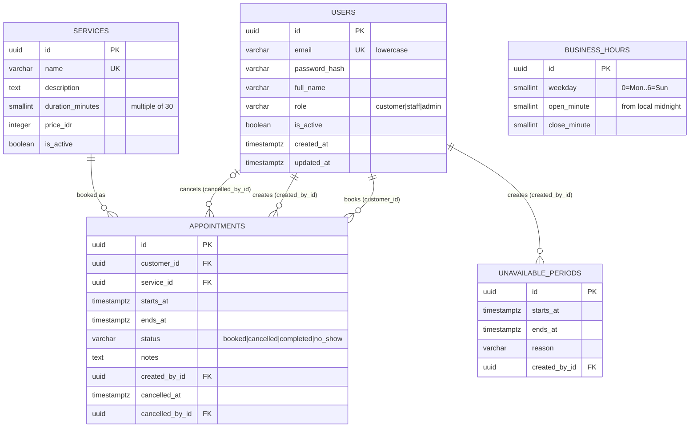

# Slotwise ERD

```mermaid
erDiagram
    USERS ||--o{ APPOINTMENTS : "books (customer_id)"
    USERS ||--o{ APPOINTMENTS : "creates (created_by_id)"
    USERS |o--o{ APPOINTMENTS : "cancels (cancelled_by_id)"
    USERS ||--o{ UNAVAILABLE_PERIODS : "creates (created_by_id)"
    SERVICES ||--o{ APPOINTMENTS : "booked as"

    USERS {
        uuid id PK
        varchar email UK "lowercase"
        varchar password_hash
        varchar full_name
        varchar role "customer|staff|admin"
        boolean is_active
        timestamptz created_at
        timestamptz updated_at
    }
    SERVICES {
        uuid id PK
        varchar name UK
        text description
        smallint duration_minutes "multiple of 30"
        integer price_idr
        boolean is_active
    }
    BUSINESS_HOURS {
        uuid id PK
        smallint weekday "0=Mon..6=Sun"
        smallint open_minute "from local midnight"
        smallint close_minute
    }
    UNAVAILABLE_PERIODS {
        uuid id PK
        timestamptz starts_at
        timestamptz ends_at
        varchar reason
        uuid created_by_id FK
    }
    APPOINTMENTS {
        uuid id PK
        uuid customer_id FK
        uuid service_id FK
        timestamptz starts_at
        timestamptz ends_at
        varchar status "booked|cancelled|completed|no_show"
        text notes
        uuid created_by_id FK
        timestamptz cancelled_at
        uuid cancelled_by_id FK
    }
```